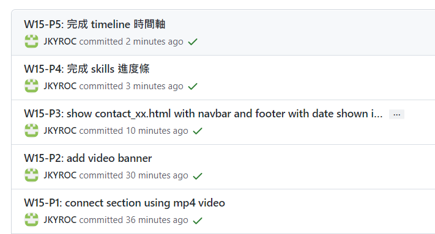

### Github repo url

[My Github repo](https://github.com/JKYROC/1111-sweb-demo-208410349.git)

[My vercel repo](https://1111-sweb-demo-208410349-m3nw.vercel.app/)
### w11-12: 


```
7668474 JKYROC  Thu Nov 17 21:40:49 2022 +0800  answer of p4_xx using scss
08e9619 JKYROC  Thu Nov 17 20:55:46 2022 +0800  answer of p3_xx using scss
9536d9f JKYROC  Thu Nov 17 20:03:22 2022 +0800  Merge branch 'main' of https://github.com/JKYROC/1111-sweb-demo-208410349
9e9f1f7 JKYROC  Thu Nov 17 20:01:08 2022 +0800  answer of p1_xx using scss
```

### w13


```
dc5f7f9 JKYROC  Wed Dec 28 11:59:44 2022 +0800  w13-P1:show fixed navbar
3c48577 JKYROC  Wed Dec 28 12:32:45 2022 +0800  W13-P2: show photo in Hero section
8cb6b8d JKYROC  Wed Dec 28 12:38:16 2022 +0800  W13-P3: show hero info in Hero section
```

### w14


```
454b568 JKYROC  Wed Dec 28 12:48:10 2022 +0800  W14-P1: html for projects section
0e945a8 JKYROC  Wed Dec 28 12:52:57 2022 +0800  W14-P2: projects section for phone
df09c01 JKYROC  Wed Dec 28 13:07:14 2022 +0800  W14-P3: projects section for another three breakpoints
656022c JKYROC  Wed Dec 28 13:09:30 2022 +0800  service section with 2 breakpoints (done by students)

```

### w15


```
47f44a0 JKYROC  Wed Dec 28 13:52:58 2022 +0800  W15-P5: 完成 timeline 時間軸
506aac5 JKYROC  Wed Dec 28 13:52:06 2022 +0800  W15-P4: 完成 skills 進度條
0012efb JKYROC  Wed Dec 28 13:45:26 2022 +0800  W15-P3: show contact_xx.html with navbar and footer with date shown in year
7fe9efe JKYROC  Wed Dec 28 13:25:04 2022 +0800  W15-P2: add video banner
```


