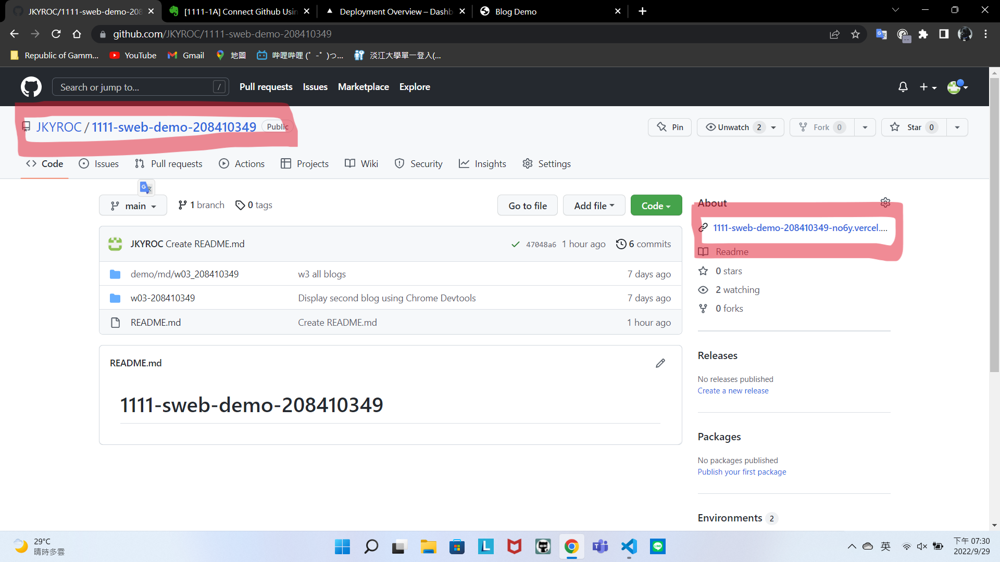
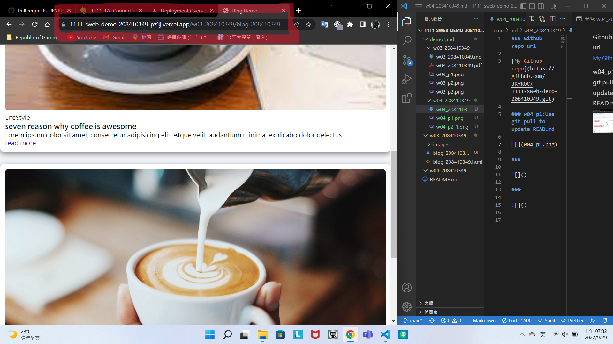
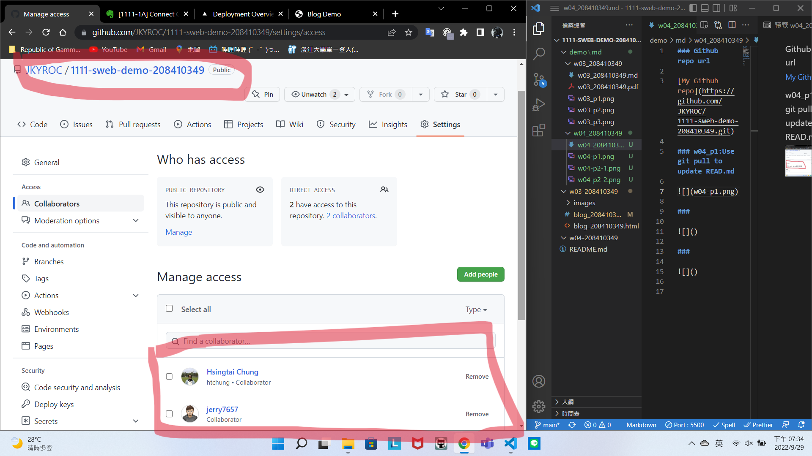

### Github repo url

[My Github repo](https://github.com/JKYROC/1111-sweb-demo-208410349.git)

### w04_p1:Use git pull to update READ.md 


### w04_p2:Display Github to Vercel





### w04_p3:Share GitHub repo to teacher and ta



### w04_p4:Add HomePage.html as HomePage, and show in Vercel


### w04_p5:finish w03 blog demo with hover and transition


### w04_p6:Add font awesome css, add two icons


### w04_p7:w4 all logs


```
$ git log --pretty=format:"%h%x09%an%x09%ad%x09%s" --after="2022-09-28"
bead55d JKYROC  Fri Sep 30 03:06:04 2022 +0800  w04-Add font awesome css, add two icons
bbf9672 JKYROC  Thu Sep 29 21:02:18 2022 +0800  rework
5462df0 JKYROC  Thu Sep 29 20:55:29 2022 +0800  homepage
d8a914e JKYROC  Thu Sep 29 20:39:44 2022 +0800  home page
4428aff JKYROC  Thu Sep 29 20:11:56 2022 +0800  w04
47048a6 JKYROC  Thu Sep 29 18:28:58 2022 +0800  Create README.md

```
