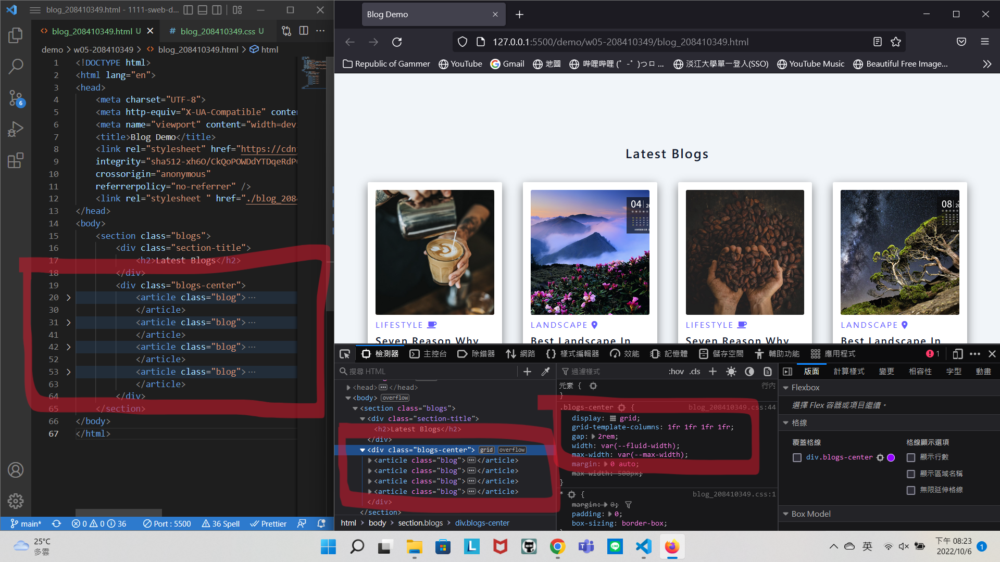
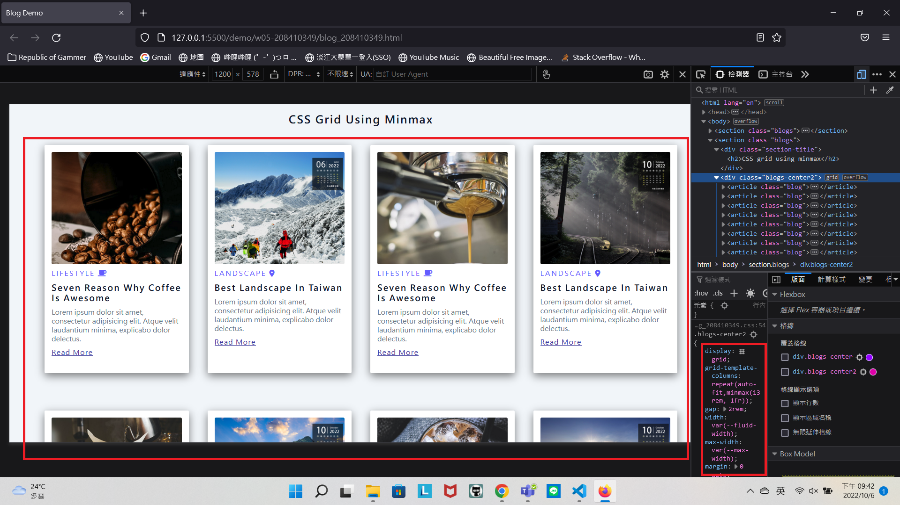

### Github repo url

[My Github repo](https://github.com/JKYROC/1111-sweb-demo-208410349.git)

### w05_p1: Add w04 link in index.html


### w05_p2: get 9 photo using small sizes


### w05_p3: Use grid to show 4 photos in a row




### w05_p4: Add w05 link in index.html,and show it in vercel


### w05_p5: Using css grid with minmax to display 9 photos





### w05_logs: w05 all logs


```
$ git log --pretty=format:"%h%x09%an%x09%ad%x09%s" --after="2022-10-05"
1df4d4a JKYROC  Thu Oct 6 22:15:22 2022 +0800   w05_p5: using css grid with minmax to display 9 photos
8c7ff78 JKYROC  Thu Oct 6 20:29:12 2022 +0800   Add w05 link in index.html, and show it in vercel
98cac79 JKYROC  Thu Oct 6 20:25:32 2022 +0800   use grid to show 4 photos in a row
d15fdd9 JKYROC  Thu Oct 6 19:24:52 2022 +0800   w05-p2 get 9 photo using small sizes
b46d703 JKYROC  Thu Oct 6 19:03:26 2022 +0800   add w04 index.html link to versel
f2080f1 JKYROC  Thu Oct 6 18:47:41 2022 +0800   add w04 link to index.html

```
