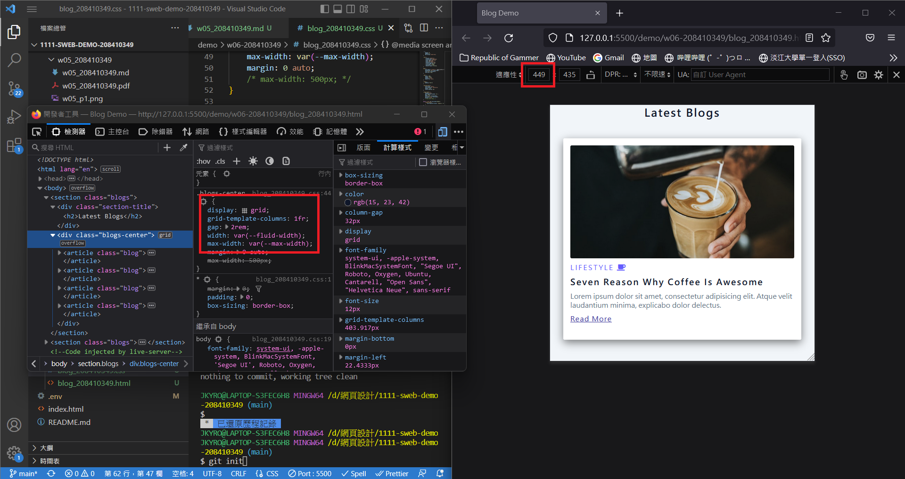
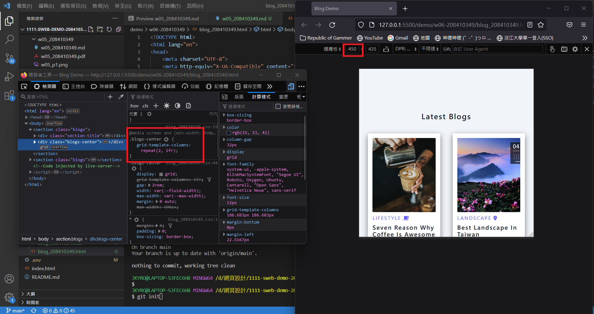
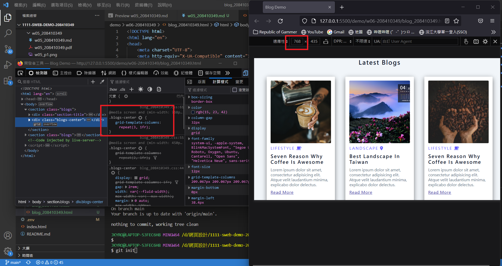
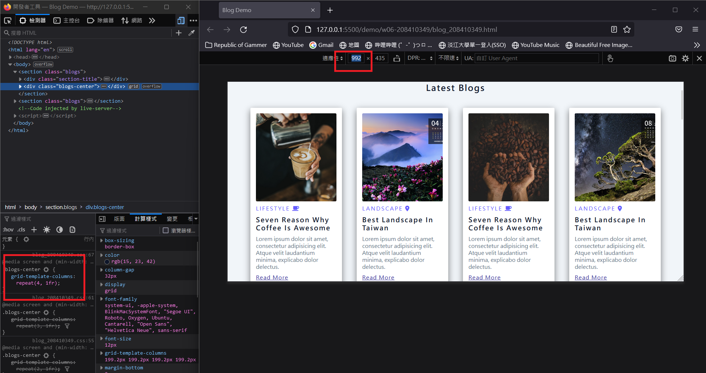
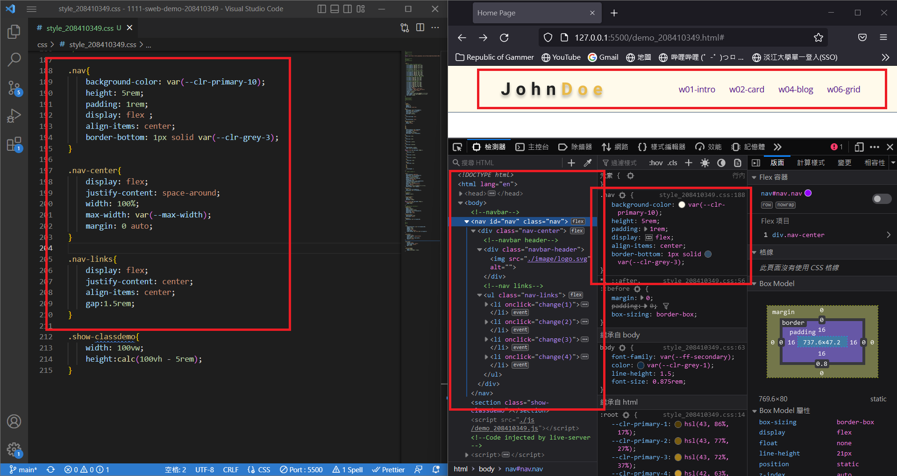
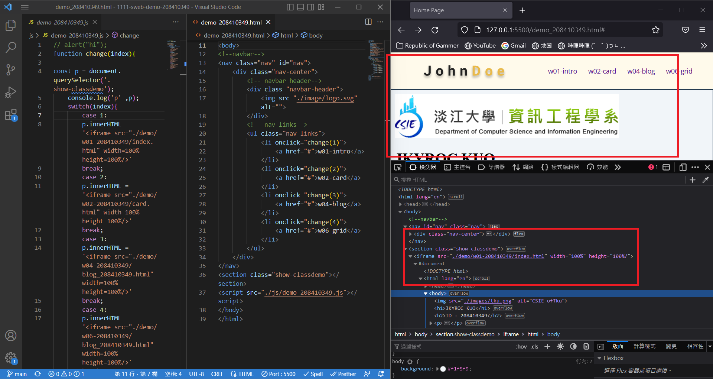
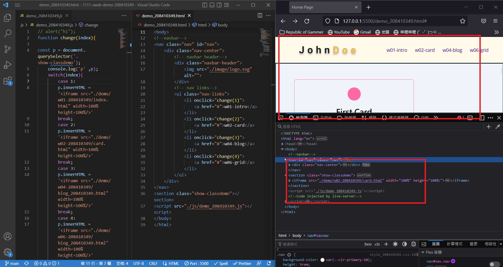
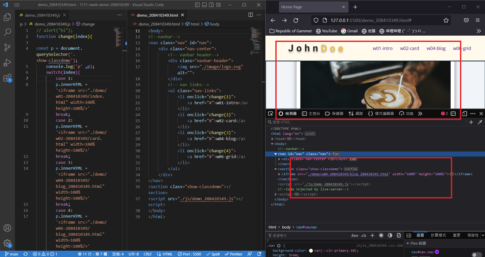
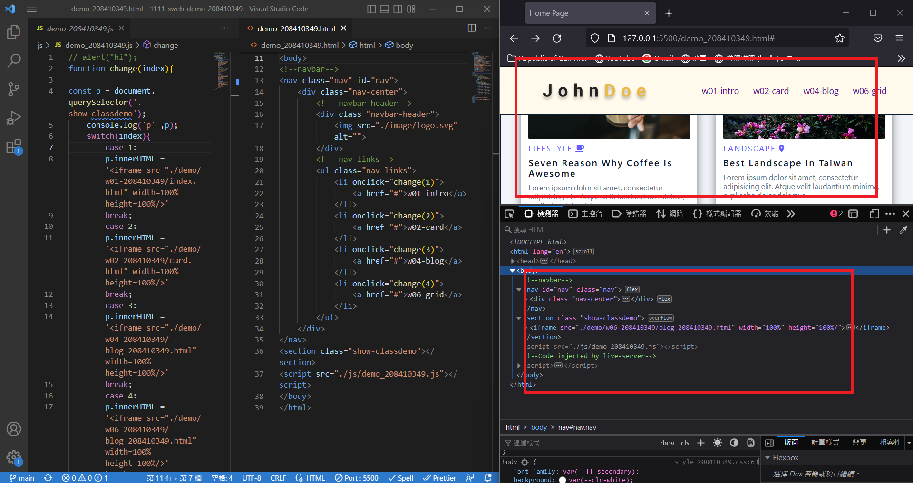

### Github repo url

[My Github repo](https://github.com/JKYROC/1111-sweb-demo-208410349.git)

### w06_p1:add 3 break points for different devices







### w06_p2:Add navbar for demo links




### w06_p3:Run 4 class demo one dy one






```
$ git log --pretty=format:"%h%x09%an%x09%ad%x09%s" --after="2022-10-12"
977b621 JKYROC  Thu Oct 13 21:40:25 2022 +0800  Run 4 class demo one by one
15e9edd JKYROC  Thu Oct 13 21:31:26 2022 +0800  Add navbar for demo links
36e2dc9 JKYROC  Thu Oct 13 19:22:29 2022 +0800  Add 3 break points for different devices
```
