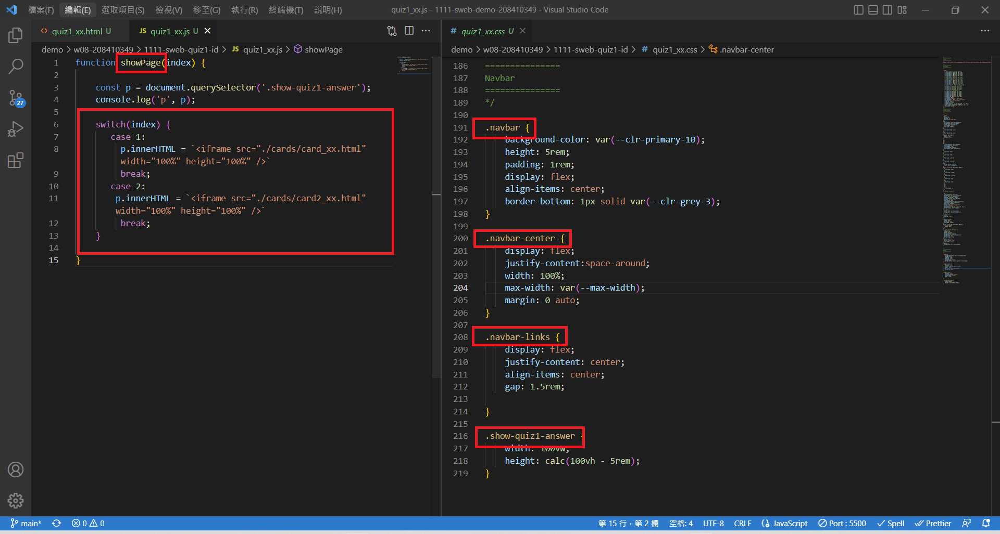
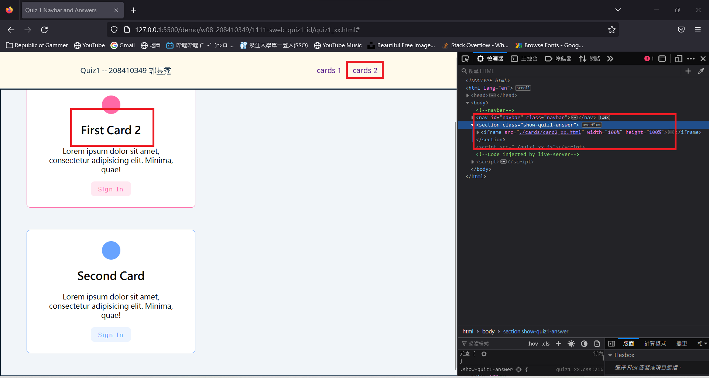
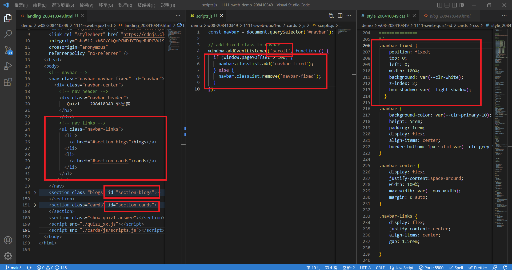
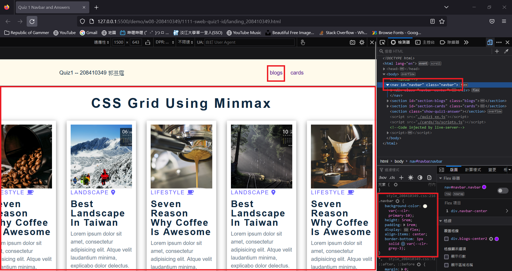
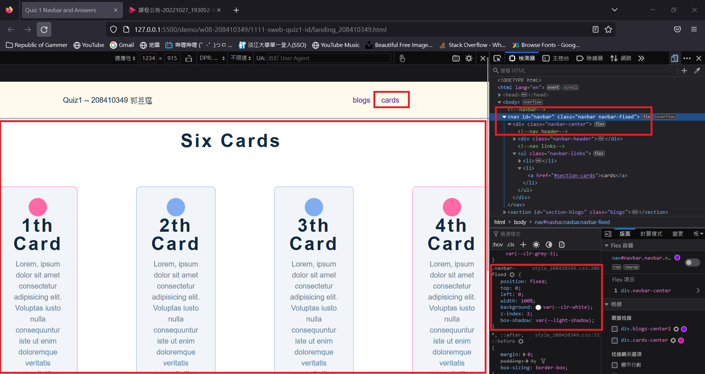
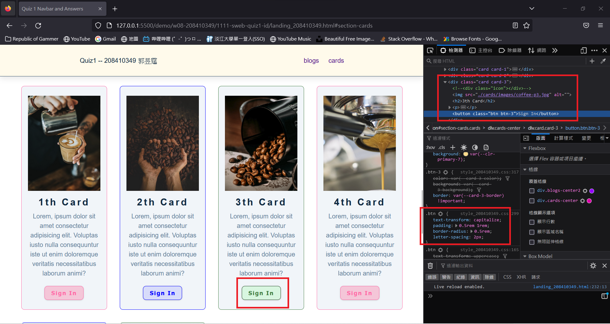
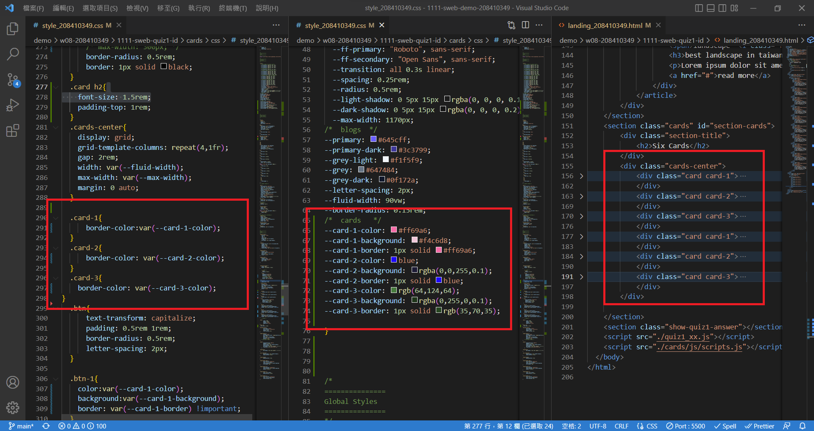
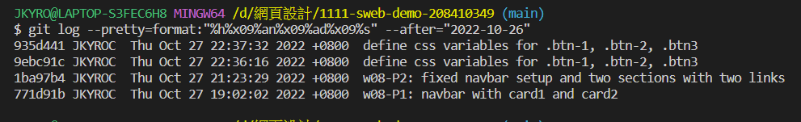

### Github repo url

[My Github repo](https://github.com/JKYROC/1111-sweb-demo-208410349.git)

### w08-P1: navbar with card1 and card2





### w08-P2: fixed navbar setup and two sections with two links




### w08-P3: define css variables for .btn-1, .btn-2, .btn3



### w08-P4: logs

```
$ git log --pretty=format:"%h%x09%an%x09%ad%x09%s" --after="2022-10-26"
935d441 JKYROC  Thu Oct 27 22:37:32 2022 +0800  define css variables for .btn-1, .btn-2, .btn3
9ebc91c JKYROC  Thu Oct 27 22:36:16 2022 +0800  define css variables for .btn-1, .btn-2, .btn3
1ba97b4 JKYROC  Thu Oct 27 21:23:29 2022 +0800  w08-P2: fixed navbar setup and two sections with two links
771d91b JKYROC  Thu Oct 27 19:02:02 2022 +0800  w08-P1: navbar with card1 and card2

```
