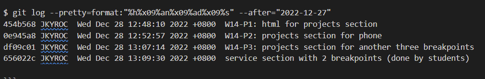

### Github repo url

[My Github repo](https://github.com/JKYROC/1111-sweb-demo-208410349.git)
### W14-P1: html for projects section


### W14-P2: projects section for phone


### W14-P3: projects section for another three breakpoints


### W14-P4: service section with 2 breakpoints (done by students)


### W14-logs:



```
$ git log --pretty=format:"%h%x09%an%x09%ad%x09%s" --after="2022-12-27"
454b568 JKYROC  Wed Dec 28 12:48:10 2022 +0800  W14-P1: html for projects section
0e945a8 JKYROC  Wed Dec 28 12:52:57 2022 +0800  W14-P2: projects section for phone
df09c01 JKYROC  Wed Dec 28 13:07:14 2022 +0800  W14-P3: projects section for another three breakpoints
656022c JKYROC  Wed Dec 28 13:09:30 2022 +0800  service section with 2 breakpoints (done by students)

```
