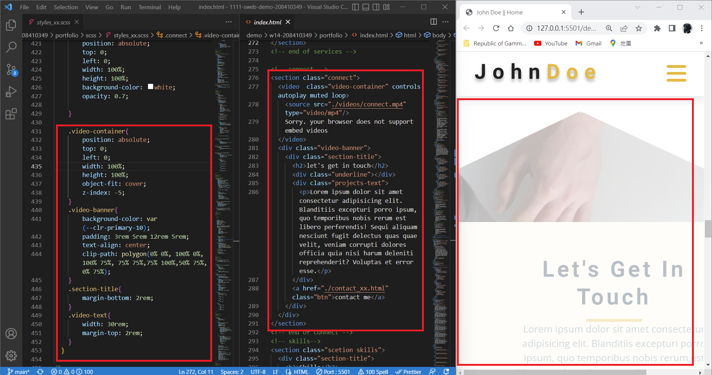

### Github repo url

[My Github repo](https://github.com/JKYROC/1111-sweb-demo-208410349.git)
### W15-P1: connect section using mp4 video


### W15-P2: add video banner



### W15-P3: show contact_xx.html with navbar and footer with date shown in year


### W15-P4: 完成 skills 進度條


### W15-P5: 完成 timeline 時間軸


```
$ git log --pretty=format:"%h%x09%an%x09%ad%x09%s" --after="2022-12-27"

47f44a0 JKYROC  Wed Dec 28 13:52:58 2022 +0800  W15-P5: 完成 timeline 時間軸
506aac5 JKYROC  Wed Dec 28 13:52:06 2022 +0800  W15-P4: 完成 skills 進度條
0012efb JKYROC  Wed Dec 28 13:45:26 2022 +0800  W15-P3: show contact_xx.html with navbar and footer with date shown in year
7fe9efe JKYROC  Wed Dec 28 13:25:04 2022 +0800  W15-P2: add video banner

```
